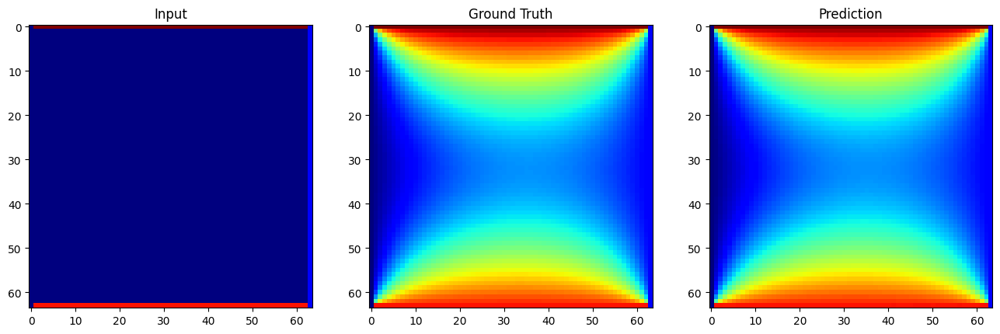

# HeatDiffusion

## Denoising Diffusion Model for Steady State Heat Conduction 
In this project a conditional diffusion model is implemented to predict the final state of a conduction on a square plate given the initial conditions. 
</img>
